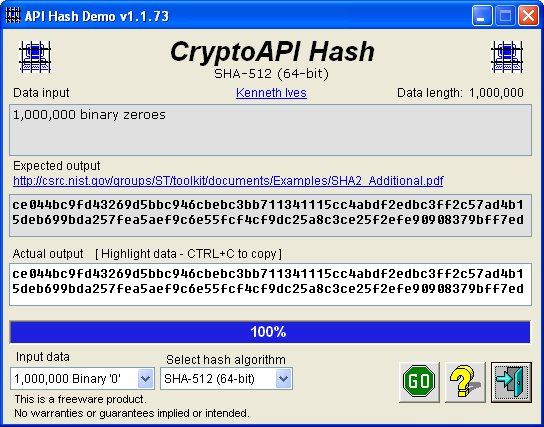

## Hashing with CryptoAPI  15\-Jun\-2012

### Description

Example of using MS CryptoAPI hash algorithms (MD2, MD4, MD5, SHA1,SHA256, SHA384, SHA512) available with Windows. Very well documented.

=== 08-Mar-2012 Updated reference to FIPS 180-4 dated Mar-2012.

----

15-Jun-2012 Updated documentation and support modules.
 
### More Info
 

             |
---                |---
**Submitted On**   |2012-06-14 18:38:00
**By**             |[Kenaso](https://github.com/Planet-Source-Code/PSCIndex/blob/master/ByAuthor/kenaso.md)
**Level**          |Intermediate
**User Rating**    |4.8 (24 globes from 5 users)
**Compatibility**  |VB 6\.0
**Category**       |[Encryption](https://github.com/Planet-Source-Code/PSCIndex/blob/master/ByCategory/encryption__1-48.md)
**World**          |[Visual Basic](https://github.com/Planet-Source-Code/PSCIndex/blob/master/ByWorld/visual-basic.md)
**Archive File**   |[Hashing\_wi2224986152012\.zip](https://github.com/Planet-Source-Code/kenaso-hashing-with-cryptoapi-15-jun-2012__1-73477/archive/master.zip)

